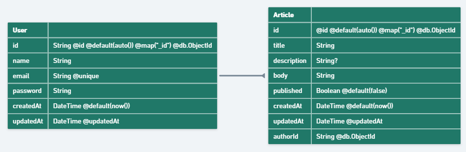
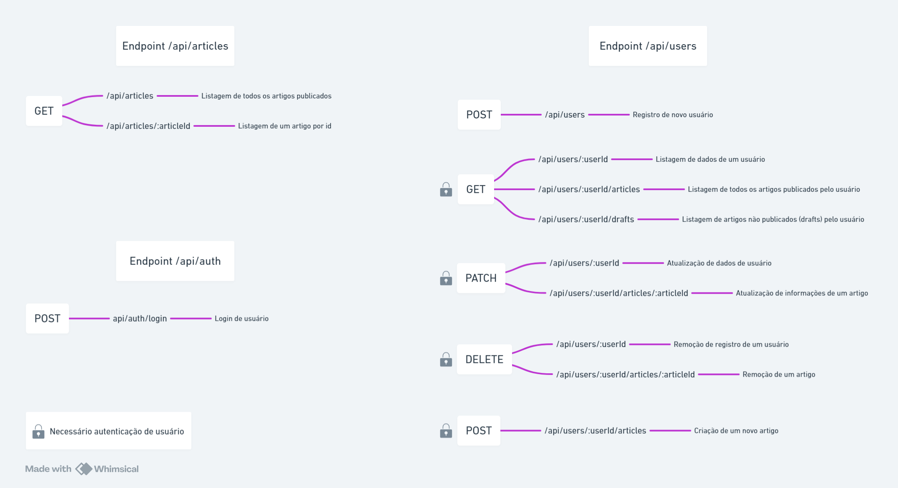

# Tech Blog API

## Descrição

-   API REST desenvolvida utilizando do framework NestJS com TypeScript que possibilita, após o registro e autenticação do usuário, a criação e o compartilhamento/publicação de seus artigos pessoais. Para usuários não autenticados é possível acessar a relação completa de artigos listados com a indicação de seus respectivos autores;
-   Projeto desenvolvido utilizando Docker e Docker Compose de forma a permitir uma escalibilidade mais eficaz e um desenvolvimento mais eficiente utilizando containers;
-   A aplicação implementa a validação e serialização de dados utilizando das funcionalidades de DTOs e Entities disponibilizadas pelo framework NestJS;
-   Autenticação de usuário via JWT e autorização de rotas utilizando das funcionalidades de Guards e Middlewares disponibilizadas pelo NestJS;
-   Gerenciamento de banco de dados NoSQL MongoDB com Prisma ORM;
-   Projeto estruturado visando a escalabilidade e melhor manutenção do código. Para isso foi utilizado o padrão de design de software MVC (model-view-controller) e injeção de dependências;
-   Utilização de logs customizados e gerenciamento de ambientes para melhor manutenção do código.

## Tecnologias utilizadas

-   [NestJS](https://nestjs.com/): Framework para criação de aplicações back-end;
-   [Prisma](https://www.prisma.io/): ORM utilizado em conjunto do MongoDB;
-   [MongoDB](https://www.mongodb.com/): Banco de dados NoSQL;
-   [Docker](https://docs.docker.com/): Plataforma para criação e gerenciamento de aplicações em containers;
-   [Docker Compose](https://docs.docker.com/compose/): Ferramenta para configurar e rodar múltiplos containers de forma simplificada;
-   Passport: Middleware para implementação das funcionalidades de autenticação de usuário;
-   Helmet: Middleware para implementação de segurança da aplicação;
-   Joi: Schema para validação de dados;
-   TypeScript: Linguagem de programação utilizada.

## Funcionalidades da aplicação

1. Registro de usuários;
2. Acesso SEM autenticação:
    - Listagem de todos os artigos publicados com a indicação dos respectivos autores;
    - Listagem de um artigo por meio de id;
    - Listagem de um artigo por meio de busca por título do mesmo.
3. Após login e COM autenticação do usuário via JWT:
    - Listar, editar e excluir dados do usuário autenticado;
    - Registrar, editar e excluir artigos publicados e não publicados (drafts) de propriedade do usuário autenticado;

### Diagrama entidade relacionamento



## Pré-requisitos

-   [Git](https://git-scm.com/)
-   [Docker Desktop](https://www.docker.com/)
-   [MongoDB Atlas](https://www.mongodb.com/)

## Clonando o projeto

```bash
git clone <github template url> <project_name>
```

## Variáveis de ambiente

Copie o arquivo '.env.example' e o renomeie para '.env'. Substitua os valores das variáveis de ambiente presentes no arquivo, para os valores de suas credenciais.

Esse projeto utiliza as seguintes variáveis de ambiente:

| Nome           | Descrição                                                        | Obrigatório |
| -------------- | ---------------------------------------------------------------- | ----------- |
| DATABASE_URL   | Connection string para conexão com o MongoDB Atlas               | [x]         |
| JWT_SECRET     | Chave secreta do Token                                           | [x]         |
| JWT_EXPIRES_IN | Tempo de expiração do Token (ex.: "1h", "30m", etc.)             | [x]         |
| PORT           | Porta utilizada para o recebimento das requisições pelo servidor | [x]         |

## Inicializando a aplicação com Docker

Inicializando a aplicação com Docker:

```bash
cd <project_name>
docker compose up
```

Navegue até `http://localhost:{PORT}` para acessar a URL base da API, sendo `{PORT}`a numeração da variável de ambiente definida anteriormente

Para parar a aplicação e remover os containers, abra um novo terminal e no diretório raiz do projeto utilize o comando:

```bash
docker compose down
```

## Documentação

Acesse a interface Swagger das rotas da API em `http://localhost:{PORT}/docs`

### Diagrama de rotas


